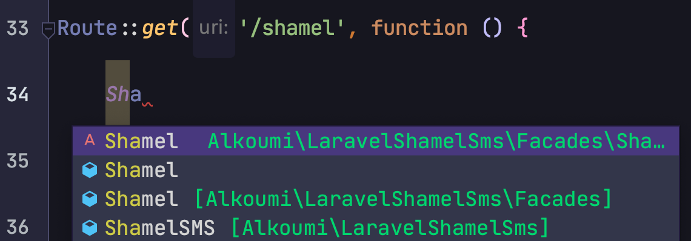
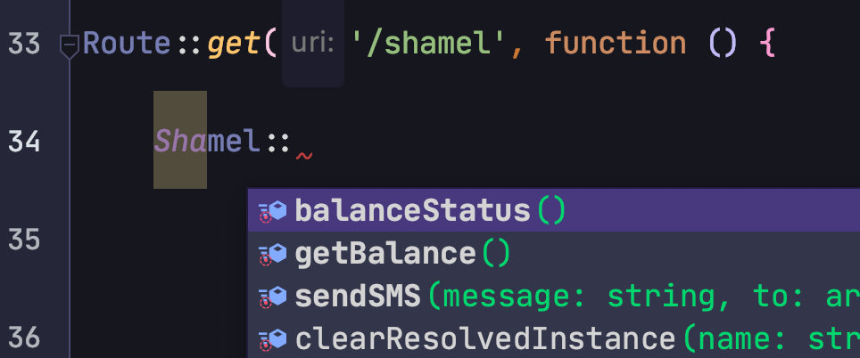

[](//packagist.org/packages/alkoumi/laravel-shamel-sms)
[](//packagist.org/packages/alkoumi/laravel-shamel-sms)
[](//packagist.org/packages/alkoumi/laravel-shamel-sms)


## Laravel Shamel SMS Library إرسال الرسائل القصيرة من خلال بوابة شامل
This is a Laravel package to send SMS using www.shamelsms.net :
## Installation

1. Install the package using Composer:
```
Composer require alkoumi/laravel-shamel-sms
```

2. After updating composer, the service provider will automatically get registered. Or you may manually add the service provider in `config/app.php`

```
    'providers' => [
        // ...
        Alkoumi\LaravelShamelSms\ShamelServiceProvider::class,
    ];
```
3. Publish the configuration file using:
```
php artisan vendor:publish --provider='Alkoumi\LaravelShamelSms\ShamelServiceProvider'
```
4. In your `.env` file add your shamelsms.net login details
```
SHAMEL_SMS_USERNAME=username
SHAMEL_SMS_PASSWORD=password
SHAMEL_SMS_FORMALSENDER=sender
SHAMEL_SMS_ADSSENDER=sender-AD
SHAMEL_SMS_ADMINMOBILE=0500175200
SHAMEL_SMS_ADMINEMAIL=mohammedelkoumi@gmail.com
SHAMEL_SMS_NOTIFYUNDER=5000
```
Don't forget to clear the cache `php artisan cache:clear` or `php artisan config:cache` after editing `.env` file 😉
## Usage in `.php` files 

Better 😍 AutoComplete with  `barryvdh/laravel-ide-helper` :

```
    use Alkoumi\LaravelShamelSms\Facades\Shamel;
    
    $mobileNumbers = ['0500175200'];
    Shamel::sendSMS('جعل الله ما قدمتكم 💳 في ميزان ⚖ حسنناتكم 💝 ',$mobileNumbers);
```
## Usage in `.blade.php` files 
```
    {{ \Alkoumi\LaravelShamelSms\Facades\Shamel::sendSMS('جعل الله ما قدمتكم 💳 في ميزان ⚖ حسنناتكم 💝 ',$mobileNumbers); }}
```

For now, numbers should be entered without the country code without leading zeros or +
### One Recipient or Multiple Recipients:
You can also pass an array of numbers in Numbers[] Array :
```
    $mobileNumbers = ['05xxxxxxxx', '05xxxxxxxx'];
    Shamel::sendSMS('جعل الله ما قدمتكم 💳 في ميزان ⚖ حسنناتكم 💝 ',$mobileNumbers);
```

#### Give Me 💗 Cup of ☕️ Coffee here https://patreon.com/mohammadelkoumi
